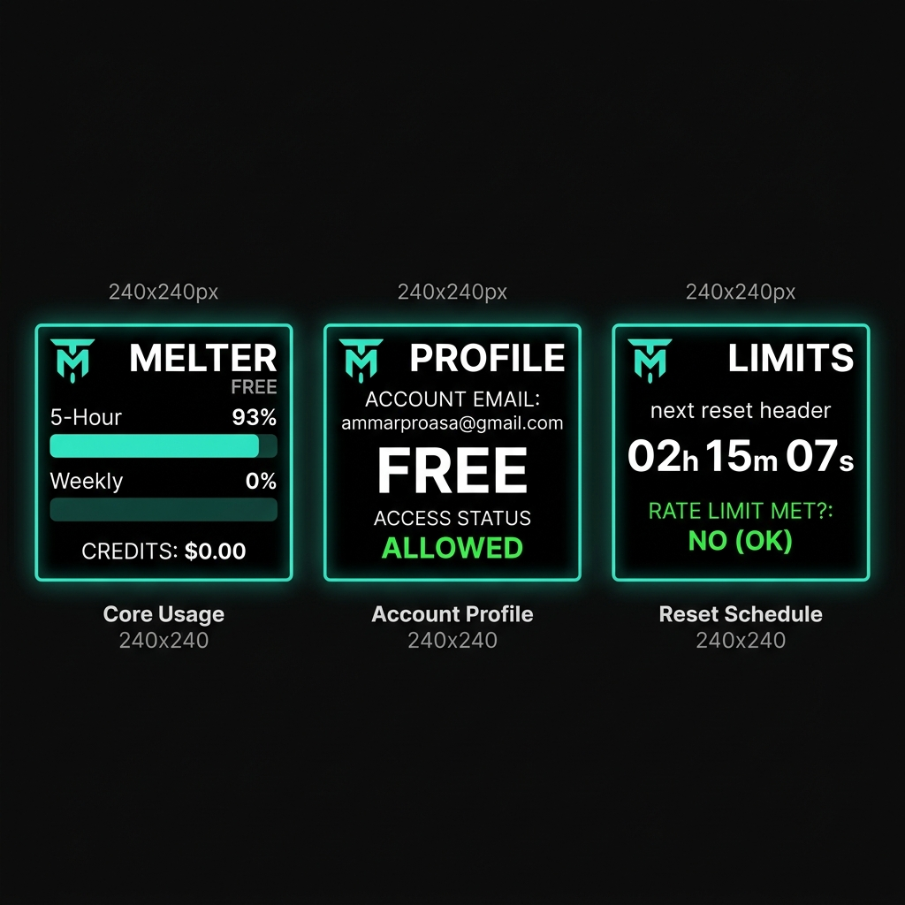

# 🌟 TokenMelter 🌟

### Real-Time Physical LLM & AI Assistant Token Dashboard

**TokenMelter** is an open-source, ultra-responsive physical dashboard built on the ESP32 that connects securely to AI assistant backends (supporting OpenAI's ChatGPT, with modular design hooks preserved for Anthropic's Claude and future models) to monitor your live API usage, membership plan, credits, and token rate limits in real-time. 

With a premium **three-page cycling slideshow**, **zero-flicker layout engine**, and a **real-time ticking countdown timer**, TokenMelter transforms raw rate-limit JSON payloads into a sleek desktop gadget.

---

## 📸 visual Assets & Mockups

### 📟 Three-Page Cycling Slideshow Interface


---

## ⚡ Key Features

*   **Rotating Slideshow (Cycle: 5s)**: Auto-rotates through three highly legible pages showing different subsets of account data without cluttering the screen.
*   **Ticking Real-Time Countdown**: Dynamically counts down the remaining hours, minutes, and seconds until your rate limit resets, refreshing the screen smoothly every second.
*   **Zero-Flicker SPI Rendering**: Writes to the display *only* when page shifts or background data updates occur, leaving the SPI bus cold, the CPU running cold, and screen elements perfectly stable.
*   **Multitasking FreeRTOS Engine**: Offloads all heavy TLS/SSL secure negotiations to a dedicated background task on **Core 0** with a spacious 32 KB stack, bypassing stack overflows and keeping Core 1's display loop running smoothly at 30 FPS.
*   **On-Screen Wi-Fi Diagnostics**: Displays exact, translated Wi-Fi connection states (`WL_NO_SSID_AVAIL`, `WL_CONNECT_FAILED`, `WL_DISCONNECTED`, `WL_NO_SHIELD`) live on the display to make troubleshooting network errors instant.
*   **Automated Credential Sync**: Includes a cross-platform Python tool that extracts active OAuth session tokens and auto-detects Wi-Fi SSIDs, compiling secrets into `src/auth_data.h` (which is fully `.gitignore`d).

---

## 🛠️ Hardware Requirements

To build your own TokenMelter, you will need:
1.  **ESP32 Development Module**: Dual-core ESP32-WROOM-32 or ESP32-WROVER (recommended).
2.  **ST7789 TFT LCD Display**: 240x240 resolution, 1.3" or 1.5" diagonal screen, SPI interface (No CS pin needed).

### 🔌 Pin Wiring Connections

Connect your ST7789 LCD display to your ESP32 board using the following wiring configuration:

| Display Pin | Description | ESP32 GPIO Pin | Details |
| :--- | :--- | :--- | :--- |
| **GND** | Ground | **GND** | Common Ground |
| **VCC** | Power | **3.3V / 5V** | Power supply (3.3V recommended) |
| **SCL** | Serial Clock | **GPIO 18** | VSPI Hardware SCK |
| **SDA** | Serial Data Input | **GPIO 23** | VSPI Hardware MOSI |
| **RES** | Reset | **GPIO 4** | Screen Reset Control |
| **DC** | Data / Command | **GPIO 2** | Register Select (RS / DC) |
| **BLK** | Backlight Control | **GPIO 15** | Driven HIGH to enable backlight |

---

## 💻 Software Setup & Installation

### Step 1: Install PlatformIO
TokenMelter is structured as a standard PlatformIO project. Ensure you have VSCode and the **PlatformIO IDE Extension** installed, or install the [PlatformIO Core CLI](https://docs.platformio.org/page/core/index.html).

### Step 2: Extract & Sync Credentials
TokenMelter queries ChatGPT's internal usage API. Your access tokens and local Wi-Fi credentials must be synchronized. 

Run the cross-platform sync tool in your terminal:
```bash
python update_auth.py
```

This utility will automatically:
1. Locate your local ChatGPT CLI profile configuration (`%USERPROFILE%\.codex\auth.json` or `~/.codex/auth.json`).
2. Extract your active authorization bearer token and account ID.
3. Query the system to auto-detect your connected Wi-Fi SSID.
4. Prompt you for the Wi-Fi password.
5. Create `src/auth_data.h` with your configurations (fully gitignored to prevent credential leaks).

> [!NOTE]
> A clean template is provided at `src/auth_data.h.example`. If compiling manually on an offline machine, copy that template to `src/auth_data.h` and populate it yourself.

### Step 3: Build & Flash the ESP32
Connect your ESP32 to your computer using a USB-C / Micro-USB cable, then compile and flash the firmware:

```bash
# Compile and upload via PlatformIO CLI
platformio run --target upload

# Open Serial Monitor to observe live logs
platformio device monitor -b 115200
```

---

## 🗂️ Project Directory Structure

```text
TokenMelter/
├── .gitignore               # Excludes auth_data.h and binary caches
├── platformio.ini           # Pinout defines, build flags, and dependencies
├── update_auth.py           # Automated tokens & Wi-Fi sync tool
├── images/                  # Design assets and mockups
│   └── dashboard_display.png
├── src/
│   ├── main.cpp             # Multi-threaded FreeRTOS firmware
│   ├── codex_logo.h         # Pre-compiled high-contrast image array
│   ├── auth_data.h.example  # Template for auth configuration
│   └── auth_data.h          # [GITIGNORED] Actual tokens and Wi-Fi secrets
└── README.md                # This documentation
```

---

## 🛡️ Credential Security Warning

> [!WARNING]
> Under no circumstances should `src/auth_data.h` be pushed to a public repository. This file contains active OAuth tokens capable of billing against your OpenAI account and plaintext Wi-Fi passwords. Verify that `src/auth_data.h` is present in your `.gitignore` before publishing any forks.

---

## 📄 License

This project is licensed under the MIT License. Feel free to copy, modify, and build your own TokenMelter hardware!
